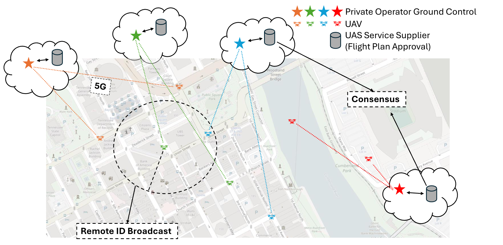
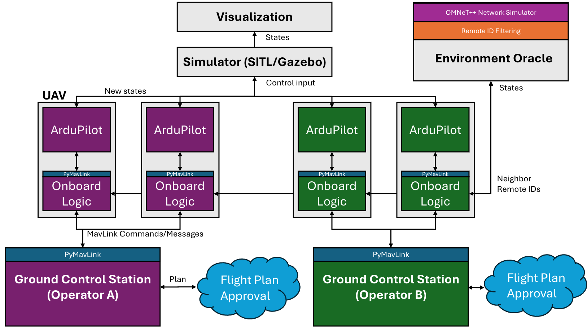

# UAV-CYBER-SIM

## A Networked Multi-UAV Simulation Framework for Coordination and Cybersecurity Research

UAV-CYBER-SIM is a modular, distributed simulator for evaluating coordinated multi-UAV operations, ground control logic, and cybersecurity vulnerabilities. It integrates ArduPilot, Gazebo, QGroundControl, and PyMAVLink to enable realistic mission execution, MAVLink communication, plan approval, and testing of system-level resilience.

---

## About


Unmanned aerial vehicles (UAVs) are expected to play an essential role in the future of air mobility. Small UAVs are already being deployed for tasks such as package delivery, surveillance, and disaster response. These missions increasingly involve complex requirements, including dynamic flight planning, multi-operator coordination, networked communications, and secure operations.

<p align="center">
  
  <br/>
  <em>Example multi-UAV simulation scenario: eight UAVs operated by four private ground stations using MAVLink over 5G. Each UAV broadcasts Remote ID locally and submits its flight plan for external approval and deconfliction.</em>
</p>

To support this evolving ecosystem, UAV-CYBER-SIM offers a comprehensive testbed for simulating and analyzing multi-UAV operations. Each UAV is managed by its own ground control station and follows a pre-approved mission plan, reflecting realistic operator behavior. The simulator also supports remote identification broadcasting, MAVLink message exchange, plan validation workflows, and adversarial testing through cyberattack simulation. This makes it well suited for research in autonomy, communication infrastructure, and secure operations across a wide range of application domains.


---


## Architecture Diagram

<p align="center">
  
  <br/>
  <em>System architecture overview: distributed multi-UAV simulation with separate processes connected via UDP/TCP. Shown for two operators, each managing two UAVs from remote ground control stations.</em>
</p>

---

## Demo Simulation Videos


<div align="center">
  
  <p><em>QGroundControl</em></p>
</div>

<br>

<div align="center">
  
  <p><em>Gazebo</em></p>
</div>


---

## Installation Instructions

### 1. Requirements
- Ubuntu 20.04 or later
- Python 3.11 (via Conda)
- ArduPilot SITL
- QGroundControl
- Gazebo with ardupilot_gazebo plugin

### 2. Setup Steps

1. Clone this repository:
   ```bash
   git clone https://github.com/4belito/uav-cyber-sim.git
   cd uav-cyber-sim
   ```

2. Install [ArduPilot](installation/Installing_Ardupilot_20_04.md)
3. Install [QGroundControl](installation/installing_qgc.md)
4. Install [Gazebo with plugin](installation/installing_gazebo_arduplugin.md)
5. If installed outside `$HOME`, modify `config.py` with correct paths.
6. Create and activate the Python environment:
   ```bash
   conda create -n uav-cyber-sim11 python=3.11
   conda activate uav-cyber-sim11
   pip install numpy pymavlink plotly nbformat
   ```

---

## Docker Option

A Docker image with preinstalled dependencies is available on Docker Hub as [dalbick/uav-cyber-sim](https://hub.docker.com/r/dalbick/uav-cyber-sim).

To enable running GUI applications (e.g. QGroundControl, Gazebo) inside Docker on Linux systems, launch the container with the following command:
```shell
docker run -u ubuntu --env="DISPLAY" --volume="/tmp/.X11-unix:/tmp/.X11-unix:rw" --volume="/dev/dri:/dev/dri:ro" --name <container name> dalbick/uav-cyber-sim
```

VS Code's 'Dev Containers' extension can be used to attach to a running container in order to run the example Jupyter notebooks. 

**If you plan on using the QGroundControl simulator, run it once manually:**
```shell
~/QGroundControl.AppImage --appimage-extract-and-run
```

**If you encounter "cannot connect to display" error, run the following on your host system:**
```shell
xhost +local:root
```

<!-- ---

## Citation
If you use this simulator, please cite the original paper:

```
@inproceedings{diaz2026uavsim,
  title={Networked Simulation for Cybersecurity Evaluation of Small Unmanned Aircraft Systems in Dense Urban Environments},
  author={Diaz-Gonzalez, Abel and others},
  booktitle={AIAA SciTech 2026},
  year={2026}
}
``` -->

---

## Contact
For questions or collaborations, email [abel.diaz.gonzalez@vanderbilt.edu](mailto:abel.diaz.gonzalez@vanderbilt.edu).

---
