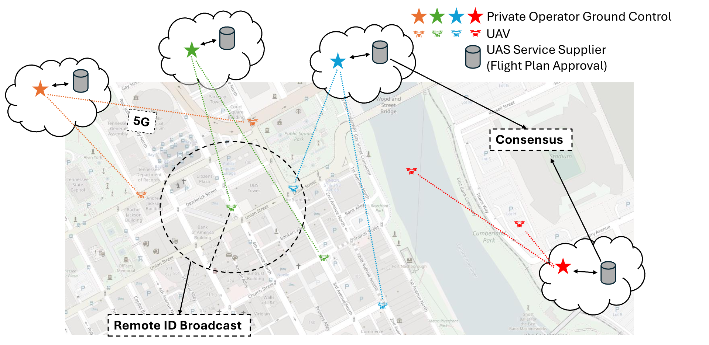
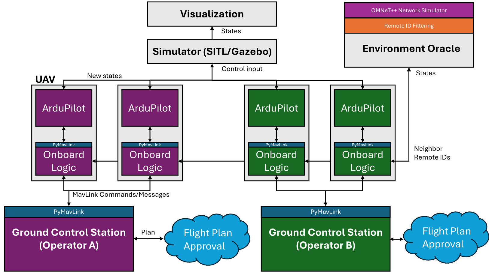

# UAV-CYBER-SIM

## A Networked Multi-UAV Simulation Framework for Coordination and Cybersecurity Research

UAV-CYBER-SIM is a modular, distributed simulator for evaluating coordinated multi-UAV operations, ground control logic, and cybersecurity vulnerabilities. It integrates ArduPilot, Gazebo, QGroundControl, and PyMAVLink to enable realistic mission execution, MAVLink communication, plan approval, and testing of system-level resilience.

---

## About


Unmanned aerial vehicles (UAVs) are expected to play an essential role in the future of air mobility. Small UAVs are already being deployed for tasks such as package delivery, surveillance, and disaster response. These missions increasingly involve complex requirements, including dynamic flight planning, multi-operator coordination, networked communications, and secure operations.

<p align="center">
  
  <br/>
  <em>Example multi-UAV simulation scenario: eight UAVs operated by four private ground stations using MAVLink over 5G. Each UAV broadcasts Remote ID locally and submits its flight plan for external approval and deconfliction.</em>
</p>

To support this evolving ecosystem, UAV-CYBER-SIM offers a comprehensive testbed for simulating and analyzing multi-UAV operations. Each UAV is managed by its own ground control station and follows a pre-approved mission plan, reflecting realistic operator behavior. The simulator also supports remote identification broadcasting, MAVLink message exchange, plan validation workflows, and adversarial testing through cyberattack simulation. This makes it well suited for research in autonomy, communication infrastructure, and secure operations across a wide range of application domains.


---


## Architecture Diagram

<p align="center">
  
  <br/>
  <em>System architecture overview: distributed multi-UAV simulation with separate processes connected via UDP/TCP. Shown for two operators, each managing two UAVs from remote ground control stations.</em>
</p>

---

## Demo Simulation Videos


<div align="center">
  
  <p><em>QGroundControl</em></p>
</div>

<br>

<div align="center">
  
  <p><em>Gazebo</em></p>
</div>


---

## Installation Instructions

### Option 1: Docker (Recommended)

Pull the pre-built image — ArduPilot SITL, Gazebo, and QGC are pre-compiled. See [Docker Setup](docs/installation/docker_setup.md) for full details.

```shell
make pull
make run
```

### Option 2: Local Installation

Install each component natively on Ubuntu:

- [Installing ArduPilot (Ubuntu 20.04)](docs/installation/Installing_Ardupilot_20_04.md) — ArduPilot + MAVProxy
- [Installing Gazebo & ArduPilot Plugin](docs/installation/installing_gazebo_arduplugin.md) — Gazebo with the ArduPilot bridge plugin
- [Installing QGroundControl](docs/installation/installing_qgc.md) — QGC ground control station

### Remote Access

- [Remote Connection](docs/installation/remote_connection.md) — connect to a remote Ubuntu server and run GUI apps (Gazebo, QGC) inside Docker via VNC

<!-- ---

## Citation
If you use this simulator, please cite the original paper:

```
@inproceedings{diaz2026uavsim,
  title={Networked Simulation for Cybersecurity Evaluation of Small Unmanned Aircraft Systems in Dense Urban Environments},
  author={Diaz-Gonzalez, Abel and others},
  booktitle={AIAA SciTech 2026},
  year={2026}
}
``` -->

---

## Contact
For questions or collaborations, email [abel.diaz.gonzalez@vanderbilt.edu](mailto:abel.diaz.gonzalez@vanderbilt.edu).
